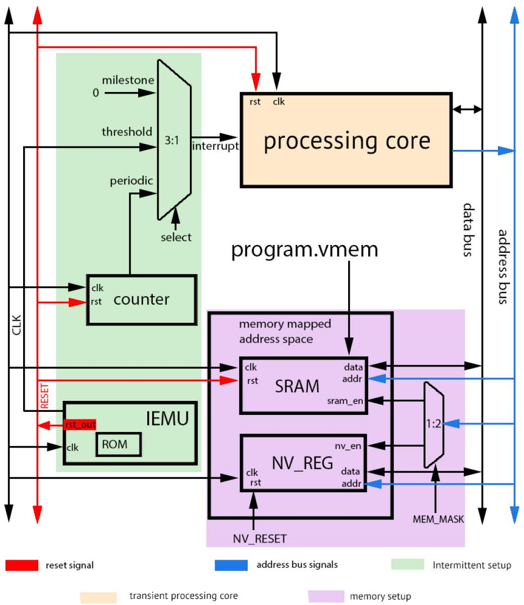

# Intermittent-Computing-Emulation-of-Ultra-Low-Power-Processors
A SystemVerilog implementation of the paper:

> *Intermittent Computing Emulation of Ultra-Low-Power Processors: Evaluation of Backup Strategies for RISC-V*

## Overview

This project implements an intermittent computing emulator for a RISC-V processor. The emulator models power failures and state backup/recovery mechanisms to evaluate different backup strategies for ultra-low-power systems.

## Features

- RV32I-compatible processor
- Intermittent power failure emulation
- Non-volatile memory state backup
- Interrupt-based checkpoint mechanism
- SystemVerilog implementation
- RISC-V software examples

## Architecture

<p align="center">
  
</p>

## Repository Structure

```
.
├── rtl/                    # RTL source files
|    └── ibex_core/
|           └── ibex_*.sv   # Ibex core systemverilog codes
|    └── intermittent/
|           └── *.sv        # Intermittency support wrapper
|
├── scripts/                # Utility scripts
|    └── bin_to_mem.py      # Binary (.bin) to verilog memory (.mem) support
|
├── software/               # RISC-V software
|    ├── main.c
|    ├── crt0.s
|    └── link.ld
|
├── tb/                     # Testbench
|    └── intermittent_tb.sv
|
└── README.md
```

## Building the Software

Compile the software using a RISC-V GCC toolchain:

```bash
riscv32-unknown-elf-gcc -march=rv32imc_zicsr -mabi=ilp32 -c software/main.c -o software/main.o

riscv32-unknown-elf-gcc -march=rv32imc_zicsr -mabi=ilp32 -c software/crt0.S -o software/crt0.o

riscv32-unknown-elf-gcc -nostartfiles -T software/link.ld software/crt0.o software/main.o -o software/program.elf
```
```bash
riscv32-unknown-elf-objcopy -O binary software/program.elf software/program.bin 
```

Convert the generated binary into a Verilog memory file:

```bash
python scripts/bin_to_mem.py software/program.bin rtl/intermittent/program.mem
```

## Simulation

Load `program.mem` into the instruction memory and run the SystemVerilog simulation using your preferred simulator.

## Requirements

- RISC-V GCC Toolchain
- Python 3
- A SystemVerilog simulator

## Reference

If you use this project, please cite the original paper:

> *Intermittent Computing Emulation of Ultra-Low-Power Processors: Evaluation of Backup Strategies for RISC-V*
